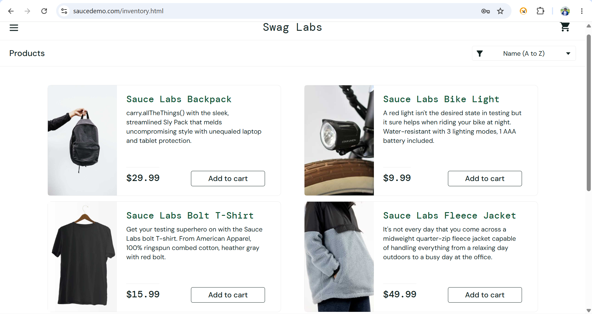
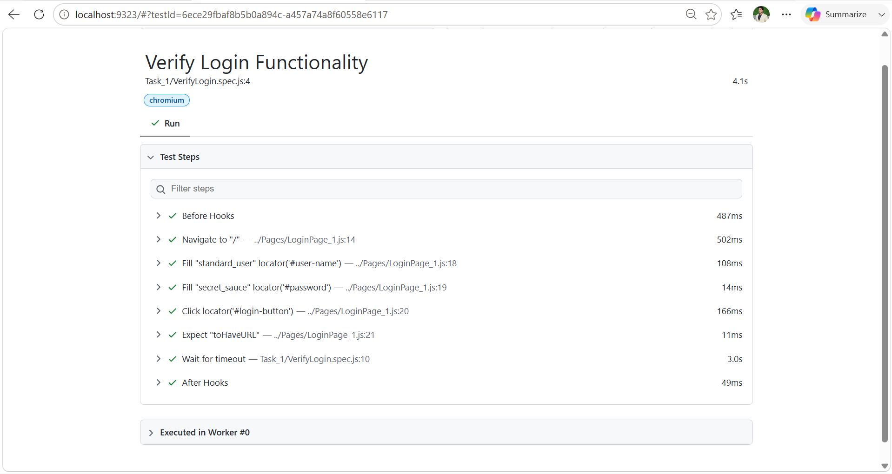

# 🚀 Playwright JavaScript Automation Framework

> A comprehensive Playwright automation framework built with JavaScript, covering **50 real-world automation testing scenarios** from beginner to advanced level.


---

# 📌 Project Overview

This repository contains **50 real-world Playwright automation tasks** developed using **JavaScript**.

The goal of this project is to learn Playwright from beginner to advanced level while following industry-standard automation framework practices and Git workflows.

---

# 🛠 Tech Stack

- Playwright
- JavaScript (ES6+)
- Node.js
- Git
- GitHub

---

# 📂 Project Structure

```text
playwright-javascript-automation-framework/
│
├── .github/
├── Docs/
├── Img/
├── Pages/
├── tests/
├── .gitignore
├── package.json
├── package-lock.json
├── playwright.config.js
└── README.md
```

---

# 📖 Topics Covered

- UI Automation
- Assertions
- Locators
- Page Object Model (POM)
- File Upload
- File Download
- Frames
- Alerts
- Windows & Tabs
- Tables
- Mouse Actions
- Keyboard Actions
- API Testing
- Network Interception
- Authentication
- Parallel Execution
- CI/CD

---

# 📋 Task Progress

| Task    | Description                | Status       |
| ------- | -------------------------- | ------------ |
| Task 01 | Verify Login Functionality | ✅ Completed |
| Task 02 | Verify Invalid Login       | ⏳ Pending   |
| Task 03 | Verify Page Title          | ⏳ Pending   |
| ...     | ...                        | ...          |
| Task 50 | CI/CD Integration          | ⏳ Pending   |

---

# ▶️ Installation

Clone the repository

```bash
git clone https://github.com/Umer7787/playwright-javascript-automation-framework.git
```

Navigate into the project

```bash
cd playwright-javascript-automation-framework
```

Install dependencies

```bash
npm install
```

Install Playwright browsers

```bash
npx playwright install
```

---

# ▶️ Run Tests

Run all tests

```bash
npx playwright test
```

Run a specific test

```bash
npx playwright test tests/task01-login.spec.js
```

Run in headed mode

```bash
npx playwright test --headed
```

Run in debug mode

```bash
npx playwright test --debug
```

---

# 📊 Generate HTML Report

```bash
npx playwright show-report
```

---

# 📸 Execution Evidence

## Login Page


---

## ✅ Successful Login



---

## 📊 Playwright HTML Report



# 🌿 Git Workflow

Every task is developed in its own feature branch.

Example:

main

├── feature/task-01-login-functionality

├── feature/task-02-invalid-login

├── feature/task-03-page-title

└── ...

After review, each feature branch is merged into the `main` branch.

---

# 🎯 Learning Goals

- Master Playwright with JavaScript
- Build an industry-standard automation framework
- Learn Git and GitHub workflow
- Improve automation testing skills
- Prepare for QA Automation interviews

---

# 👨‍💻 Author

**Umer**

QA Automation Engineer | Playwright | JavaScript | Automation Testing Enthusiast

GitHub: https://github.com/Umer7787

---

⭐ If you find this repository helpful, consider giving it a Star!
