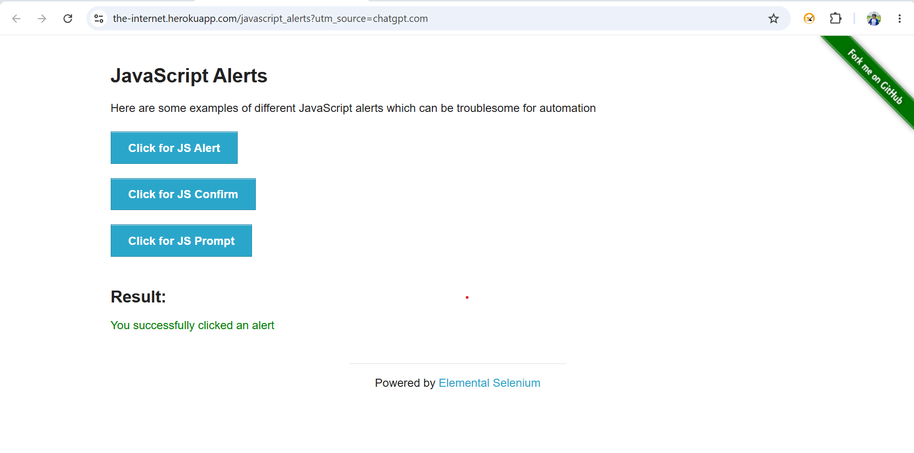
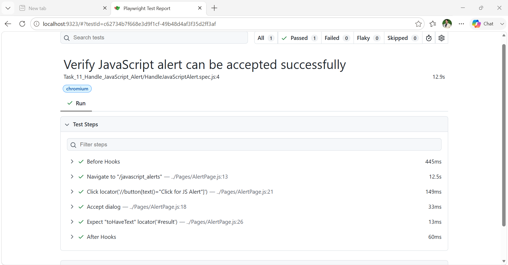

# 🚨 Task 11 - Handle JavaScript Alert

> A comprehensive Playwright automation task built with JavaScript, covering the **Verify Image Visibility** functionality using industry-standard automation practices.


---

# 📌 Project Overview

This repository contains the **Handle JavaScript Alert** Playwright automation task developed using **JavaScript**.

Automate the JavaScript Alert page and verify that a standard JavaScript Alert can be handled successfully.

---

# 🛠 Tech Stack

- Playwright
- JavaScript (ES6+)
- Node.js
- Git
- GitHub

---

# 📂 Project Structure

```text
playwright-javascript-automation-framework/
│
├── .github/
├── Docs/
├── Img/
├── Pages/
├── tests/
├── .gitignore
├── package.json
├── package-lock.json
├── playwright.config.js
└── README.md
```

---

# 📖 Topics Covered

- UI Automation
- Assertions
- Locators
- AlertButton Click & Verify
- Element Validation
- Page Object Model (POM)

---

# 📋 Task Progress

| Task    | Description                | Status       |
| ------- | -------------------------- | ------------ |
| Task 01 | Verify Login Functionality | ✅ Completed |
| Task 02 | Verify Invalid Login       | ✅ Completed |
| Task 03 | Verify Page Title          | ✅ Completed |
| Task 04 | Checkbox Validation        | ✅ Completed |
| Task 05 | Radio Button Validation    | ✅ Completed |
| Task 06 | Text Box Validation        | ✅ Completed |
| Task 07 | Dropdown Selection         | ✅ Completed |
| Task 08 | Verify Button Actions      | ✅ Completed |
| Task 09 | Dynamic Content Validation | ✅ Completed |
| Task 10 | Verify Image Visibility    | ✅ Completed |
| Task 11 | Handle JavaScript Alert    | ✅ Completed |
| ...     | ...                        | ...          |
| Task 50 | CI/CD Integration          | ⏳ Pending   |

---

# ▶️ Installation

Clone the repository

```bash
git clone https://github.com/Umer7787/playwright-javascript-automation-framework.git
```

Navigate into the project

```bash
cd playwright-javascript-automation-framework
```

Install dependencies

```bash
npm install
```

Install Playwright browsers

```bash
npx playwright install
```

---

# ▶️ Run Tests

Run the test

```bash
npx playwright test tests/Task_10_Image_Visibility/HomePage.spec.js
```

Run in headed mode

```bash
npx playwright test tests/Task_10_Image_Visibility/HomePage.spec.js --headed
```

Run in debug mode

```bash
npx playwright test tests/Task_10_Image_Visibility/HomePage.spec.js --debug
```

---

# 📊 Generate HTML Report

```bash
npx playwright show-report
```

---

# 📸 Execution Evidence

## Home Page


---

### JavaScript Alert



---

## 📊 Playwright HTML Report



---

# 🌿 Git Workflow

Every task is developed in its own feature branch.

Example:

```text
main
├── feature/task-01-login-functionality
├── feature/task-02-invalid-login
├── feature/task-03-page-title
├── feature/task-04-checkbox-validation
├── feature/task-05-radio-button
├── feature/task-06-text-box
├── feature/task-07-dropdown-selection
├── feature/task-08-button-actions
├── feature/task-09-dynamic-content
├── feature/task-10-image-visibility
├── feature/task-11-jsAlert-Hanlde
└── ...
```

After review, each feature branch is merged into the `main` branch.

---

# 🎯 Learning Goals

- Master Playwright with JavaScript
- Build an industry-standard automation framework
- Learn Git and GitHub workflow
- Improve automation testing skills
- Prepare for QA Automation interviews

---

# 👨‍💻 Author

**Umer**

QA Automation Engineer | Playwright | JavaScript | Automation Testing Enthusiast

GitHub: https://github.com/Umer7787

---

⭐ If you find this repository helpful, consider giving it a Star!
